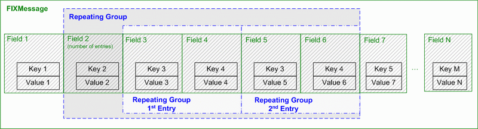

# Basic concepts
## Main components
The main FIX Antenna components are:
- `FixServer` - listens for incoming connections
- `IFixServerListener` - listener for incoming connections. The `NewFixSession(IFixSession session)` 
method is called for every new connection and `session.Connect()` should be called to accept a connection. The `session.ConnectAsync()` method also extsts. 
- `IFixSessionListener` - listener for new messages and session state changes
- `FixMessage` - a list of `TagValue` that could be either FIX message or FIX message content
- `IFixSession` - either a FIX Session acceptor or initiator capable of sending/receiving messages
- `IFixSessionFactory` - session factory for the initiator
- `IErrorHandler` - error and warning condition listener (not required but recommended for production applications)
- `IMessageValidator` - validates the current message

## FixServer description
`FixServer` is needed to accept incoming connections. It starts to listen for incoming connections after the `Start()` method.
After the` Stop()` method, the server stops listening but the application does not stop until all 
sessions are disconnected. To be able to accept incoming sessions, `IFixServerListener` should be set.

## IFixServerListener description
`void NewFixSession(IFixSession session)` is executed for every new connection. If `session.Connect()` is not called in
this method then connection is rejected. To process messages, call `session.SetFixSessionListener(IFixSessionListener listener)`.

## IFixSessionListener description
Contains two methods:
- `void OnSessionStateChange(SessionState sessionState)` - called when session state is changed
- `void OnNewMessage(FixMessage message)` - called for every incoming application message

## IFixSession description

The FIX session is represented by the `IFixSession` interface. This interface is responsible for:
- Managing the session state
- Sending outgoing application-level messages

Each session incapsulates a message storage that is used to store the sent and
received messages and a queue.
A session could be configured to use memory or files on disk to store/queue messages. 
File storage is reliable and fault tolerant.
Memory storage is much faster, but not fault tolerant.

## Repeating Groups description

A FIX message may contain repeating groups. Each group contains:
- Leading tag that contains the number of repeating group entries.
- Repeating group entries.
- At least one tag is required for each entry. That is always the 1st tag in the entry that plays the 
role of entries separator.

Repeating groups are usually addressed by a leading tag.

To access fields inside a repeating group, it is required to get
a field value specifying entry number. Entries are enumerated starting from 1.



Note: `FixMessage` contains a convenient method `Split(int repeatingGroupLeadingTagNumber)` 
that splits a repeating group and provides the list of `FixMessage` for that repeating group.

## Message validation

The `IFixSession.MessageValidator` property returns `IMessageValidator` that could be used to 
validate a message. It could be used to validate both message content:
```csharp
IValidationResult ValidateContent(string msgType, FixMessage content);
```
and an entire FIX message:
```csharp
IValidationResult Validate(FixMessage message);
```
