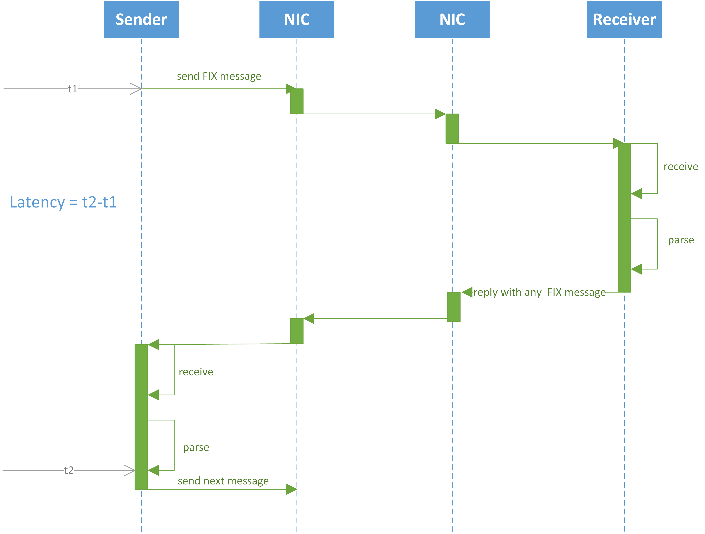

# Benchmarking FIX Antenna .NET Core

## Environment

### Server host (epam1)
- Intel(R) Xeon(R) CPU E5-2687W v3 @ 3.10GHz (2 CPU, 20 Cores)
- RAM 128 GB, 2133 MHz
- NIC Solarflare Communications SFC9120 (Firmware-version: 4.2.2.1003 rx1 tx1)
- Linux (CentOS 7.0.1406 kernel 3.10.0-957.21.3.el7.x86_64)
- SolarFlare driver version: 4.1.0.6734a

### Client host (epam2)
- Intel(R) Xeon(R) CPU E5-2643 v3 @ 3.40GHz (2 CPU, 12 Cores)
- RAM 128 GB, 2133 MHz
- NIC Solarflare Communications SFC9120 (Firmware-version: 4.2.2.1003 rx1 tx1)
- Linux (CentOS 7.0.1406 kernel 3.10.0-957.21.3.el7.x86_64)
- SolarFlare driver version: 4.1.0.6734a

## Test scenario
### Single Session Echo Scenario

FA .NET Core has one acceptor session configured on server host.
Client application has one initiator session configured on client host.
The overall process is following:

Client application connects to the FA .NET Core instance and sends 200 000 FIX 4.2 messages with a rate of 10 000 messages per second.
FA .NET Core receives the messages and matches it to the same session using business layer logic.
FA .NET Core responds to the client application with the same message in the same session.
The response time measured by client application is the difference between timestamps:

t1 - timestamp taken right before sending message to client session.
t2 - timestamp taken right after received the same message in client back from FA .NET Core.
The round-trip time formula is: RTT=t2-t1 and measured in microseconds.

The scenario is the same for FIX Antenna C++. Please see details [here](https://kb.b2bits.com/pages/viewpage.action?pageId=27689053#BenchmarkingofFIXAntennaC++2.19.0Linux-Testscenario)

The Sender part latency will be the same in both cases (as for testing FIX Antenna C++ and FIX Antenna .Net Core) and roughly it can be considered as half of numbers from here for Optimized.hard configuration.

## Results

### Test configurations
- Nagle's algorithm - disabled
- Affinity - sessions threads are pinned to the specific CPU core.
- Message validation - disabled
- Storage type and Queue type - In memory
- Solarflare OpenOnload - the kernel bypass technique by Solarflare is used.
- Echo benchmark for transient session

## FIX Antenna .NET Core 1.0.2, µsec
| |Run #1|Run #2|Run #3|
|---|---|---|---|
|Min	|13.096	|12.792	|12.584|
|Max	|199.423|209.663|223.871|
|Median	|16.151	|16.023	|16.127|
|Average|16.3719|16.1782|16.2766|
|50%	|16.151	|16.023	|16.127|
|75%	|16.447	|16.311	|16.415|
|90%	|16.671	|16.559	|16.639|
|95%	|16.911	|16.751	|16.863|
|99%	|19.903	|19.695	|19.839|
|99.9%	|80.063	|80.703	|81.535|
|99.99%	|182.655|186.623|187.647|

