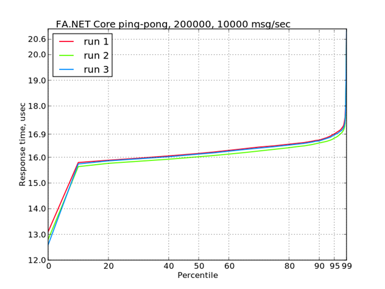

# FIX Antenna™ .NET Core Community Edition
FIX Antenna™ .NET Core is a high-performance low latency .NET [FIX](https://btobits.com/fixopaedia/index.html) Engine.  Ideal solution for buy side and proprietary trading companies.

## [Fast response time](Docs/benchmarking.md)

## Requirements & Compatibility
The engine is based on .NET Standard 2.0 and is compatible with any platform that supports .NET Standard 2.0 e.g. .NET Framework 4.8, .NET Core 3.1, .NET 5, .NET 6.0.

Samples and libraries were tested with .NET Framework 4.8 and .NET 6.0 under Windows 10 and Linux Ubuntu 16.04.

.NET SDK 6.0 is required to build and run samples

## [Quick start guide](Docs/QuickStart.md)

## Features
- [FIX Engine](Docs/features.md#fix-engine)
- [Session processing](Docs/features.md#sessions-processing)
- [Storage](Docs/features.md#storage)
- [Performance tuning](Docs/features.md#performance-tuning)
- [Message composition API](Docs/features.md#message-composition-api)
- [Security](Docs/features.md#security)

## Current State
2022 – FIX Antenna .NET Core 1.0 Community Edition (open source)

## [Changelog](CHANGELOG.md)

## Roadmap
- [x] NuGet packages
- [ ] Message decorator
- [ ] Scheduler
- [ ] REST admin and monitoring interface

## Samples description
|Sample name|Folder|Description|
|---|---|---|
|[EchoServer](Docs/InstallationAndUninstallation.md#echoserver)|[Samples/EchoServer](Samples/EchoServer)|A very simple server, which sends all the received messages back to a client.|
|[ConnectToGateway](Docs/InstallationAndUninstallation.md#connecttogateway)|[Samples/ConnectToGatway](Samples/ConnectToGateway)|A very simple client, which connects to the server and accepts all received messages.|
|[SimpleServer](Docs/InstallationAndUninstallation.md#simpleserver)|[Samples/SimpleServer](Samples/SimpleServer)|Demonstrates how to implement a FIX server with simple IP filtering of incoming sessions.|
|[SimpleAdminClient](Docs/InstallationAndUninstallation.md#simpleadminclient)|[Samples/SimpleAdminClient](Samples/SimpleAdminClient)|Demonstrates how to connect to an administrative session and communicate with it using the implementation of administrative messages.|
|[ConnectToGatewayAsync](Docs/InstallationAndUninstallation.md#connecttogatewayasync)|[Samples/ConnectToGatewayAsync](Samples/ConnectToGatewayAsync)|Version of 'ConnectToGateway' using 'session.ConnectAsync(...)'|

## How to build and run samples

#### With Visual Studio
Recommended version is [Visual Studio 2022](https://visualstudio.microsoft.com/vs/)

1. Open `FixAntenna\Epam.FixAntenna.sln` in Visual Studio
2. Choose Debug configuration
3. Build → Rebuild solution
4. Find the `Samples\EchoServer\bin\Debug\net6.0\EchoServer.exe` and run
5. Find the `Samples\ConnectToGateway\bin\Debug\net6.0\ConnectToGateway.exe` and run

#### With CLI
1. Make sure you have .NET SDK 6.0 installed
2. `dotnet build Epam.FixAntenna.sln -c Debug -f net6.0`
3. Find the `Samples\EchoServer\bin\Debug\net6.0\EchoServer.exe` and run
4. Find the `Samples\ConnectToGateway\bin\Debug\net6.0\ConnectToGateway.exe` and run

## Documentation
- [Backgrounder](Docs/Backgrounder.md)
- [Basic concepts](Docs/BasicConcepts.md)
- [Configuration](Docs/Configuration.md)
- [FIX Message](Docs/FixMessage.md)
- [Prepared message](Docs/FixPreparedMessage.md)
- [FIX Session](Docs/FixSession.md)
- [FIX Session Acceptor](Docs/FixSessionAcceptor.md)
- [FIX Session Initiator](Docs/FixSessionInitiator.md)
- [Installation and Uninstallation](Docs/InstallationAndUninstallation.md)
- [Monitoring and Administration](Docs/MonitoringAndAdministration.md)
- [Other topics](Docs/OtherTopics.md)
- [Quick Start](Docs/QuickStart.md)
- [Recovery](Docs/Recovery.md)
- [Repeating Group API](Docs/RepeatingGroupApi.md)
- [Tags Generator Tool](Docs/TagsGen.md)
- [SSL/TLS support](Docs/TlsSupport.md)
- [Validation](Docs/Validation.md)

## Contributing
1. Fork it (https://github.com/epam/fix-antenna-net-core/fork)
2. Create your feature branch (git checkout -b feature/fooBar)
3. Read our contribution guidelines and Community Code of Conduct
4. Commit your changes (git commit -am 'Add some fooBar')
5. Push to the branch (git push origin feature/fooBar)
6. Create a new Pull Request

## Development team
- [Aleksey Shuvalov](https://github.com/ashuvalov) - Developer
- [Ivan Ponomarev](https://github.com/houtengeki) - QA Engineer
- [Sergey Matveev](https://github.com/epm-sergem) - Developer
- [Vladimir Gusev](https://github.com/portowine1982) - Analyst

## License

Copyright © 2020-2022 [EPAM Systems, Inc.](https://www.epam.com/)

Distributed under [the Apache License](LICENSE), Version 2.0.

## Support

Should you have any questions or inquiries, please direct them to SupportFIXAntenna@epam.com
